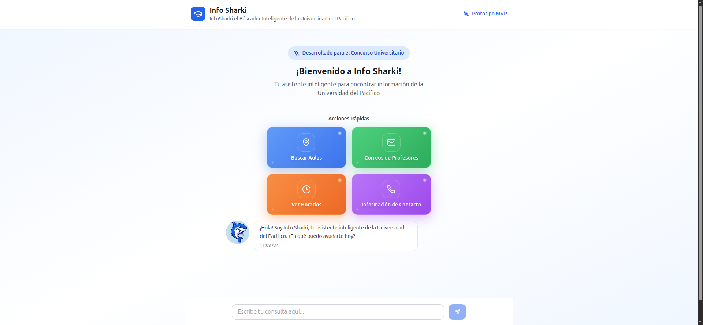

# Info Sharki - Asistente Inteligente Universitario

## 📋 Descripción del Proyecto

**Info Sharki** es un asistente virtual inteligente desarrollado para la Universidad del Pacífico, diseñado para proporcionar información académica de manera rápida y eficiente a estudiantes, profesores y personal administrativo.

Este prototipo MVP fue desarrollado específicamente para el **Concurso Universitario** de la Universidad del Pacífico, demostrando capacidades avanzadas de búsqueda y interfaz de usuario moderna.


*Captura de tela do protótipo do Info Sharki*

## 🦈 Características Principales

### 🤖 Asistente Inteligente
- **Chat interactivo** con interfaz moderna y responsive
- **Búsqueda semántica** en múltiples categorías de datos universitarios
- **Respuestas contextuales** adaptadas al tipo de consulta
- **Avatar animado** (Sharki) que mejora la experiencia de usuario

### 🔍 Capacidades de Búsqueda
- **Aulas y espacios**: Localización, capacidad y equipamiento
- **Profesores**: Información de contacto, departamentos y cargos
- **Horarios**: Materias, horarios, días y carreras
- **Contactos administrativos**: Áreas, teléfonos, emails y ubicaciones

### 🎯 Acciones Rápidas
- Botones predefinidos para consultas comunes
- Interfaz visual atractiva con efectos modernos
- Acceso inmediato a información frecuentemente solicitada

## 🛠️ Tecnologías Utilizadas

### Frontend
- **React 18** + TypeScript
- **Tailwind CSS** para estilos
- **Vite** como build tool
- **Lucide React** para iconografía

### Características Técnicas
- **Diseño responsive** para todos los dispositivos
- **Estado local** con React Hooks
- **Tipado estático** con TypeScript
- **Componentes modulares** y reutilizables

## 📁 Estructura del Proyecto

```
src/
├── components/          # Componentes de UI
│   ├── ChatInput.tsx   # Entrada de mensajes
│   ├── ChatMessage.tsx # Mensajes del chat
│   ├── QuickActions.tsx # Botones de acción rápida
│   ├── MenuButton.tsx  # Botón de reinicio
│   └── SharkIcon.tsx   # Icono del asistente
├── hooks/
│   └── useChat.ts      # Lógica del chat
├── services/
│   └── searchService.ts # Servicio de búsqueda
├── data/
│   └── universityData.ts # Datos de la universidad
├── types/
│   └── index.ts        # Definiciones TypeScript
└── App.tsx             # Componente principal
```

## 🚀 Instalación y Uso

### Prerrequisitos
- Node.js 16+ 
- npm o yarn

### Instalación
```bash
# Clonar el repositorio
git clone [url-del-repositorio]

# Instalar dependencias
npm install

# Ejecutar en modo desarrollo
npm run dev

# Construir para producción
npm run build

# Preview de la build de producción
npm run preview
```

## 💾 Datos Incluidos

El sistema incluye datos de ejemplo de la Universidad del Pacífico:

- **aulas** con información detallada de ubicación y equipamiento
- **profesores** con datos de contacto y departamentos
- **horarios** de materias con profesores y aulas asignadas
- **contactos administrativos** de diferentes áreas

## 🎨 Características de la UI/UX

### Diseño Visual
- **Gradientes modernos** y efectos de glassmorphism
- **Animaciones suaves** y transiciones
- **Paleta de colores** institucional (azules)
- **Tipografía legible** y jerarquía visual clara

### Experiencia de Usuario
- **Scroll automático** a nuevos mensajes
- **Estados de carga** y deshabilitación
- **Mensajes de error** descriptivos
- **Responsive design** para móviles y desktop

## 🔧 Personalización

### Agregar Nuevos Datos
Editar `src/data/universityData.ts` para incluir:
- Nuevas aulas
- Profesores adicionales
- Horarios actualizados
- Contactos administrativos

### Modificar Estilos
Los estilos utilizan Tailwind CSS. Modificar clases en los componentes o extender la configuración en `tailwind.config.js`.

### Extender Funcionalidades
- Agregar nuevos tipos de búsqueda en `searchService.ts`
- Crear nuevos componentes de UI en `components/`
- Implementar nuevas acciones rápidas

## 📈 Roadmap Futuro

### Mejoras Planeadas
- [ ] Integración con API real de la universidad
- [ ] Base de datos persistente
- [ ] Sistema de autenticación
- [ ] Historial de conversaciones
- [ ] Búsqueda por voz
- [ ] Notificaciones push
- [ ] Panel administrativo

## 🤝 Contribución

Este proyecto fue desarrollado como parte de un concurso universitario. Para contribuir:

1. Fork el proyecto
2. Crear una rama para tu feature (`git checkout -b feature/AmazingFeature`)
3. Commit tus cambios (`git commit -m 'Add some AmazingFeature'`)
4. Push a la rama (`git push origin feature/AmazingFeature`)
5. Abrir un Pull Request

## 📄 Licencia

Este proyecto es propiedad de la **Universidad del Pacífico** y fue desarrollado para fines académicos y de concurso.

## 👥 Desarrolladores

**Equipo Info Sharki** - Concurso Universitario 2025  
Universidad del Pacífico

---

## 🌐 Información de Contacto

**Universidad del Pacífico**  
📧 [info@upacifico.edu.py](mailto:info@upacifico.edu.py)  
🌍 [upacifico.edu.py](https://upacifico.edu.py)  
📞 +595 21 123-456

---

*¡Descubre la información universitaria de manera inteligente con Info Sharki! 🦈*
